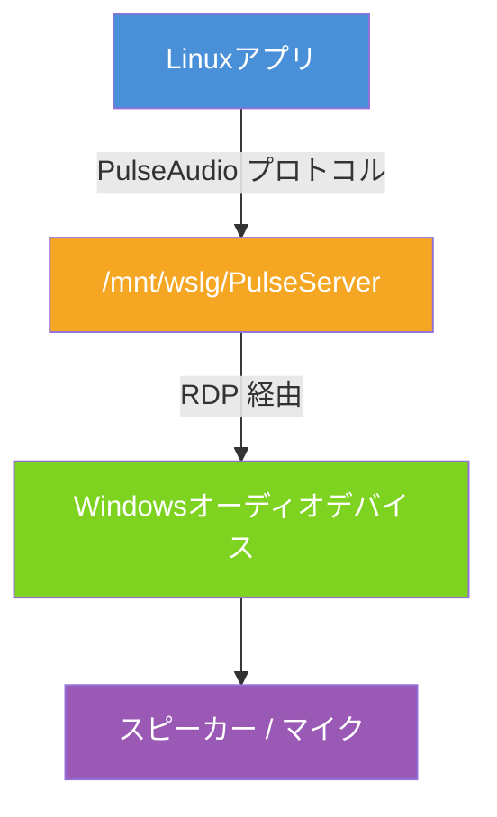
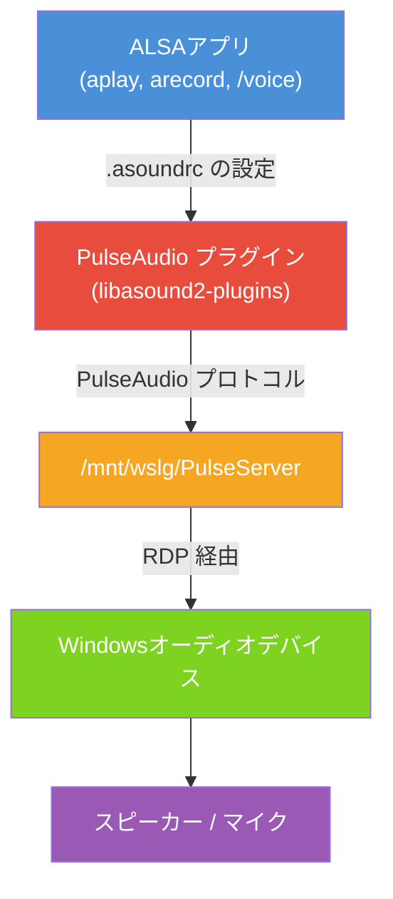

びーぐるです🐶

Claude Codeの`/voice`コマンドは、順次ユーザーに展開されてきています。

実は、Windows 11 + WSL2 Ubuntuの環境でWSL側から音声系の処理を行うのは少々面倒ですので、今回はその手順をまとめてみたいと思います。

:::message alert
本記事はWindows 10環境には対応していない場合がありますので、あらかじめご了承ください。
:::

# `/voice`コマンドとは

Claude Codeの`/voice`コマンドは、ユーザーが音声で入力することを可能にする機能です。この機能を有効にしておくと、スペースキーを長押ししている間はマイクからの入力を受け付けます。

タイプするより喋るほうが速い！という場面や周囲に人がいない場面では、非常に有効な機能かと思います。
:::message alert
現状の`/voice`コマンドにはバグがあり、有効にしていても新しいセッションを開くと無効化されてしまいます。
対策としては、2回`/voice`コマンドを打つとよいです。
すぐに修正されるとは思いますが、現状はこの点にご留意ください。
:::

https://x.com/oikon48/status/2031709912565465278

# 具体的な手順

何をしているのかを解説すると結構難しい話になるので、とりあえず手順のみをまとめます。

## 1. WSLg が有効か確認する

Ubuntu側のターミナル(bash)を開いて以下のコマンドで確認します。

```bash
ls -la /mnt/wslg/PulseServer
```

`No such file or directory` と**表示されなければ問題ありません**。

No such file or directory と表示された場合にはWSLgが有効になっていませんので、管理者モードでPowerShellを開き、以下を実行してください。

```powershell
# PowerShell(管理者モード)で実行
wsl --update
```

## 2. 必要なパッケージをインストール

以降もbash側で操作していきます。
ALSA(Advanced Linux Sound Architecture)の動作に必要なパッケージを入れます。

```bash
sudo apt update
sudo apt install -y alsa-utils libasound2-plugins
```

## 3. ALSAの設定ファイルを作成

ALSAの入出力をPulseAudio経由とするように、設定ファイルを作成します。

まず、既にファイルが存在しないか確認しておきましょう。

```bash
ls ~/.asoundrc
```
`No such file or directory` と**表示されれば問題ありません**。既にファイルがある場合は上書きされますので、必要に応じてバックアップを取ってください(`cp ~/.asoundrc ~/.asoundrc.bak`)。

```bash
cat > ~/.asoundrc << 'EOF'
pcm.default pulse
pcm.!default pulse
ctl.default pulse
ctl.!default pulse

pcm.pulse {
    type pulse
}
ctl.pulse {
    type pulse
}
EOF
```

`~/.asoundrc`ファイルが作成されました。ALSAが動作するごとに読み込まれるため、シェルの再起動は不要です。

## 4. 動作確認

音声の出力と入力がそれぞれ動くか確認します。

スピーカーのテスト(音声が聞こえればOK)

```bash
aplay /usr/share/sounds/alsa/Rear_Center.wav
```

マイクのテスト
録音(下の例は5秒間録音)

```bash
arecord -d 5 -f cd /tmp/test_mic.wav
```

再生

```bash
aplay /tmp/test_mic.wav
```

自分の声が聞こえればマイク入力も正常です。

## 5. Claude Codeで`/voice`が使えるかのテスト

```bash
claude
```

Claude Code を起動し、`/voice`と入力すればボイスモードが有効になります。
Voice mode enabled. Hold Space to record. と表示されればOK。

以降はスペースキーを長押しすると音声入力を受け付けます。

## 参考

PulseAudioを直接使うためにpulseaudio-utilsを入れておくとよいです。
paplayコマンドが利用可能になり、問題発生時の原因切り分けに役立ちます。

```bash
sudo apt install -y pulseaudio-utils
paplay /usr/share/sounds/alsa/Rear_Center.wav
```

ステータスは以下のコマンドで閲覧できます。

```bash
pactl info
```

# トラブルシューティング

## マイクが認識されない

Windows側でマイクが有効になっているか確認してください

1. Windows の「設定」→「プライバシーとセキュリティ」→「マイク」
2. 「マイクへのアクセス」が ON になっていることを確認
3. WSL を再起動 PowerShellで `wsl --shutdown` を実行後、しばらくしてからbashを起動。


他によくありそうな問題を見つけた場合追記します。


# 何をやっているのか？

上の手順で何をしていたのか、簡単に仕組みを整理します。

## WSL環境ではWSLgが橋渡し

WSL2のカーネルにはサウンドカードドライバが含まれていません。つまり、Linux側でWindows側のスピーカーやマイクを認識できない状態です。
そこでWSLg(Windows Subsystem for Linux GUI)の登場です。WSLgは内部でPulseAudioサーバーを動かしており、ソケットを `/mnt/wslg/PulseServer`としてWSL2側に公開しています。



`paplay`やPulseAudioに対応したアプリは、このソケットを通じてそのまま音声のやりとりができます。

## Claude Codeの`/voice`はALSA経由

Claude Codeの`/voice`を含め、`aplay`や`arecord`などのALSAを使うアプリは、PulseAudioとは別の仕組みで音声デバイスを探しにいきます。WSL2にはデバイスがないので、そのままではエラーになります。

```
ALSA lib confmisc.c:855:(parse_card) cannot find card '0'
```

そこで`.asoundrc`に「ALSAのデフォルトデバイスをPulseAudioにする」と書くことで、ALSAアプリの入出力もPulseAudio経由でWindowsのオーディオデバイスに到達できるようになります。



これで、Claude Codeの`/voice`コマンドがWindows側のマイクを通じて音声の入力ができるようになるというわけです。

## まとめ

Claude Codeの`/voice`コマンドをWindows 11 + WSL2 Ubuntuで使えるようにする手順をまとめました。

振り返ると、やっていることはパッケージのインストールと`.asoundrc`の作成だけです。ただ、「`.asoundrc`というファイルを作る必要がある」ということ自体が、エラーメッセージからはなかなか想像できません。デフォルト環境では本当によく見かける`cannot find card '0'`ですが、これが出て設定ファイルの作成に思い至るのは、一度経験していないと難しいかと思います。本記事が皆様の助けになれば幸いです。

また、この設定はClaude Codeに限った話ではなく、WSL2上でALSA経由の音声を扱うアプリ全般に有効となります。他のツールで音声が出ない場面でも、同じ手順で解決できるかもしれません。

Codex CLIのほうにも同じような音声入力機能がありますが、恐らくWindows + WSL2環境ではまだ動作しないと思います。Codex APP(Windows)では動作するのですが。
心待ちにしておきましょう。

# 筆者のXについて

XでもAI関連の情報の発信や交流をしておりますので、お気軽にフォローしていただければ幸いです。

https://x.com/beagle_dog_inu


# 参考文献

https://qiita.com/walterkammi/items/ba2984957503189868f2

https://note.com/bsoft/n/n0922a9d70232

https://wiki.gentoo.org/wiki/ALSA/ja