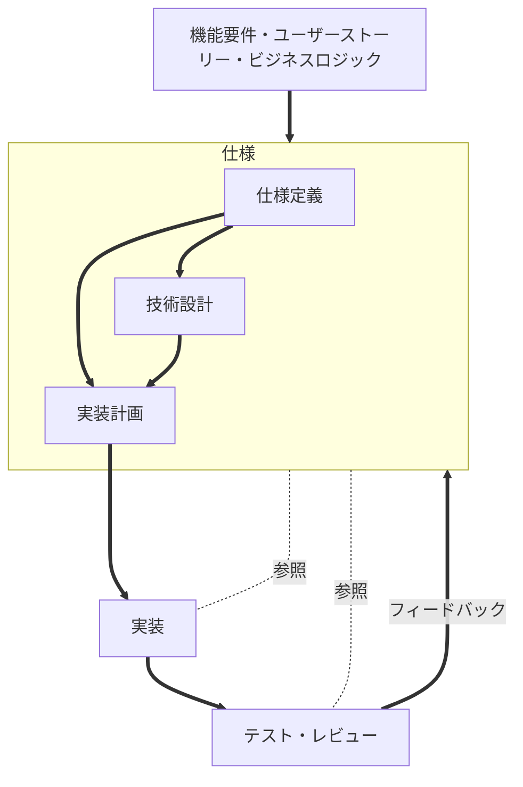

びーぐるです🐶

Agentic Codingの開発スタイルのひとつとして、仕様駆動開発(SDD)が以前にも増して注目を浴びるようになりました。

例えば、Findy様主催のイベント「仕様駆動開発〜新たな開発手法の可能性と実践〜」では、昼開催にもかかわらず1300人を超える参加者が集まっています。

https://findy.connpass.com/event/373561/

私も過去に何本かSDDを実践できるツールに関する記事を書きましたが、少し時間がたった今でもたくさんの方にご覧いただいております。
大変ありがたいことです🙇‍♂️

そこで今回は、SDD自体とその中核をなす"仕様"について、改めて整理して解説していきます。

## 更新履歴

- 2025/11/19 公開しました

## SDDとは？

SDDとは、Spec-Driven Developmentの略で**仕様駆動開発**、**Spec駆動開発**とも呼ばれます。
どのような開発手法かを端的に表すと**まず仕様と呼ばれるドキュメントを作成し、その仕様に基づいてコーディングを行う手法**です。

これだけ聞くとこれまで一般的であった開発手法と何ら変わりないように思えます。
なぜSDDが改めて注目されているのかというと、背景にはAIコーディングエージェントの登場が関係しています。

AIコーディングエージェントを利用した開発手法として**Vibe Coding**があります。
Vibe CodingはAIコーディングエージェントに自然言語で要求のみを伝え、設計や実装を一任する方法です。
Vibe Codingによりプログラミングの知識がゼロでもある程度動くものが作れるようになり、AI時代の新たな開発文化として人々に受け入れられてきました。

その反面、Vibe Codingを実世界のプロジェクトに適用すると、制作物の品質や保守性に問題が生じる、計画や意図とは違うものが出来上がり手戻りが発生する等の課題が指摘されてきました。
そこで、これらの課題をクリアできる可能性がある手法として、SDDが期待されているのです。

これまでの流れから、単にSDDというと**AIコーディングエージェントを利用したSDD**を指すことが一般的ですので、本記事内でもそのように取り扱います。
なお、定義が明確化されているわけではないので、人や組織によって、また使うAIコーディングエージェントやツールによって多少意味や手法が異なる場合があります。

## 仕様とは？

仕様とは、これから制作するものに関して**What=何を作るか / Why=なぜ作るか / How=どのような制約で作るか**をまとめた一連のドキュメントです。

仕様は複数のドキュメントになっていることが多く、代表的な構成例として「仕様定義書」+「技術設計書」+「実装計画書」があります。
仕様は「機能要件」「ユーザーストーリー」「ビジネスロジック」「各種制約や条件」等の集合をもとに、後述する代表的なツール等を利用しAIと協働して作成されます。

SDDにおいて、仕様は**SSoT**(Single Source of Truth)であると言えます。

SSoTとは、システムやプロジェクト等においてそれを「唯一の正しい情報源」とみなすという概念です。
SDDのすべての工程では仕様を中心に進められ、AIは常に仕様を参照し続け、仕様に沿ったコードを生成します。
出来上がった制作物は、理論的には仕様を忠実に反映したものになります。
SDDでは**コードはAIがプログラミング言語やフレームワークを利用して仕様を表現したもの**と言われることがあります。

## SDDのワークフロー

一般的なSDDのワークフローは以下のようになります。

## 広義の仕様と狭義の仕様

一般的なソフトウェア工学において、仕様とはいわゆる要件定義書やSDDにおける仕様定義書のような単体のドキュメントを指すことが多いです。

一方で、SDDにおける仕様は、仕様作成フェーズでつくられた一連のドキュメントたちのことを指します。

SDDの文脈で"仕様"に対する言及を行う際は、基本的には後者の仕様を指すことが多いです。
例として「仕様はSSoT」という考え方は、仕様定義書だけではなく、つくられたドキュメントすべてをSSoTとみなすという意味になります。
次の項目でも「仕様はxxx」という表現が多く出てきますが、すべて**一連のドキュメントを指している**ことに注意してください。

## SDDの特徴や思想

前項も同じようなことを述べましたが、SDDは現時点で学術的に統一された用語や定義が存在していません。
この項目ではSDDに更に踏み込み、SDDの特徴として多くの資料等で共通して挙げられるポイントをまとめます。
一部は実現困難な**理想論**的なものも含まれますが、そのような概念もSDDを理解する上での重要なポイントです。
また私的な解釈を多少交えておりますので、その点はご了承ください。

### 仕様は実行可能

仕様は自然言語で記述されますが、単なるドキュメントではなく、AIが理解できる**実行可能な仕様**である必要があります。
実行可能な仕様とは、構造化されたフォーマットで記述し、AIコーディングエージェントが仕様をもとにコーディングを遂行できるように作ったものを指します。

仕様が実行可能であるためには、**完全性**と**正確性**を持ち、そしてAIにとって**明確である**ことが求められます。

### 仕様は検証可能

仕様は明確に定義され、仕様とコードの準拠性を客観的に確認できる必要があります。
仕様が実行可能であるかに加えて、仕様からテストコードを生成し、実装が仕様に基づいているかを検証できることが求められます。

### 仕様の品質は制作物の品質に直結

AIコーディングエージェントは実行可能な仕様からコードを生成するため、コードの質を高めるためには仕様の質を高める必要があります。
仕様の品質が低いと、AIは不完全な情報に基づいてコードを生成することになり、結果として制作物の品質も低下します。
仕様を詳細に練り上げ、レビューを行い高品質に保つことは、SDDにおいて最も重要な要素の一つです。

### 仕様は追跡可能・監査可能

仕様は制作物と同様にGit等でバージョン管理される必要があります。
バージョン管理された仕様の更新履歴、そのまま制作物の更新履歴としても機能します。
そして正確に記録された仕様は、誰が、何を、いつ、なぜ変更したかを追跡できる、つまり監査可能である性質を持ちます。

### 仕様とコードの双方向同期性

従来型の開発手法では、実態としてコードがSSoTであり、仕様はコードを説明するためのものになっていることが多いです。
開発の進行により主従が逆転してしまった場合もありますが、意図的にコードファーストな開発手法が選ばれることもあります。

SDDでは仕様とコードの主従(仕様→コード)を原則固定化し、仕様からコードを生成する形をとります。
そのため、機能要件等の変更があったときの対応として、**コードを直接書き換えるのではなく、仕様を更新します**。
その後、AIコーディングエージェントに新しい仕様に基づいたコードを再生成させます。

ただし現実的には、極めて緊急なバグの修正等、諸々の事情でコードが直接変更されることは起こり得ます。
コードが直接変更された場合、変更内容を仕様に確実に反映させる必要があります。
また、コードが直接変更された理由を明確にして、記録することも重要です。

仕様がSSoTであることの価値を維持するためにも、仕様と実装の双方向同期を保ち、両者の乖離を防ぐべきです。

### 仕様はガードレール

AIコーディングエージェントが仕様に従いコードを生成している以上、仕様に沿わない暴走は起こりにくいです。
これは間接的に仕様がガードレールとして働き、AIを制御しています。

### 仕様はイテレーション可能

仕様は反復的に実装からのフィードバックを受け、改善できるようにします。
仕様は一度作成したら終わりではなく、開発の進行に伴い継続的に改善され、コードもそれに応じて洗練されていきます。

### チーム開発での有効性

SDDはチーム開発においても有効に働きます。
仕様は人間にも読める形で記述されているため、異なる役割を持つプロジェクトメンバー間での共通の認識となります。
例えば、Biz側とDev側のコミュニケーションギャップを埋める、異なる視点からの仕様レビューにより仕様の品質を高めるといった効果が期待できます。

## SDDを体現するツール

SDDの開発ワークフローを導入できる代表的なツールを紹介します。
なお、熟練の開発者はこれらのツールを使わず、直接LLMやAIコーディングエージェントを使用して仕様の作成やSDDの実践を行うこともあります。

### Kiro

まずはAWSが提供するAI IDEである**Kiro**です。

https://kiro.dev/

KiroのSpecモードは対話形式で「要求定義書」「詳細設計書」「タスクリスト」を作成することができ、これらを元にコーディングを進めていきます。

- IDEなので環境構築が容易、すぐに始めることができる
- ドキュメントはAIとの対話形式で、ステップバイステップで作成することができる
- 出力されるドキュメントは平易で端的な表現で記述されるため、レビューがしやすい
- タスクリストを一つずつ実装していくことで進捗が把握しやすい

などの特徴があり、エンジニアにはもちろんのことノンプログラマーやマネージャー層にとっても扱いやすく、SDDを広く世に知らしめるきっかけとなりました。
まさにKiroの謳い文句である「成熟したエンジニアリングプラクティスをAIワークフローにて実現するコーディングIDE」を体現したツールと言えます。
最近になりCLIツールがリリースされるなど、精力的なアップデートが続けられています。

### cc-sdd

次に、Gotaさんが開発されている**cc-sdd**です。

https://github.com/gotalab/cc-sdd

https://zenn.dev/gotalab

cc-sddはClaude CodeやCodexなどの主要なCLIツール、Cursorなどの主要なAI IDE上でSDDを実践できるようにするツールキットです。
KiroのSDDの考え方をこれらのツールに適応させることを目的としており、Kiroからの乗り換えがスムーズに行えます。
国産ツールであるため日本語の技術ブログ内で取り上げられる情報が多いのも特徴です。

### GitHub Spec Kit

そして**GitHub Spec Kit**です。

https://github.com/github/spec-kit

GitHub Spec Kitは後発ですがGitHubから提供されているため一躍注目を浴びることになりました。
こちらも主要ツールに対応しているツールキットです。
Spec Kitでは「最高法規(Constitution)」「仕様定義書(Spec)」「技術設計書(Plan)」「タスクリスト(Tasks)」の4フェーズが用意されています。
特にPlanモードでは仕様定義等に応じて、設計に関する複数のドキュメントが生成されます。
より重厚な仕様を作成でき、複雑なソフトウェア開発にも対応できるように作られています。

私も過去に記事を書いています。近日中にこの記事を改訂し、最新版に対応させる予定です。

https://zenn.dev/beagle/articles/7976e6ac40c762

### その他

**OpenSpec**
https://github.com/Fission-AI/OpenSpec

**Spec Workflow MCP**
https://github.com/Pimzino/spec-workflow-mcp

など、SDDを実践するためのツールは他にも多数存在します。

## SDDのデメリット

ここまでSDDを取り上げた内容を総合すると、様々な問題が解決できる理想的な開発手法のように思えますが、もちろんデメリットも存在します。
ここではいくつか覚えておいたほうがよい懸念点を挙げます。

1. 仕様作成・変更・維持・改善のコストがかかる

仕様をSSoTとして保つためには、初期の記述だけでなく、条件変更のたびに仕様を更新し続ける運用が必要です。
小規模で寿命の短いプロトタイプの作成やPoC開発などでは、仕様と向き合うコストが割に合わなくなるケースもあります。

2. 仕様の品質に強く依存する

「仕様は実行可能・検証可能であるべき」という前提がある一方で、実務上「仕様の多くが不定だがとりあえず実装を進めたい」といった場面が存在します。
仕様が曖昧なまま進めると、SDDであっても手戻りが大きくなり、「SDDだから安心」という誤解を招きやすい点には注意が必要です。
仕様の品質が制作物の品質に直結することは、メリットでもありこのようなデメリットにもなり得ます。

3. 学習コスト

Spec Kitは重厚な仕様を作成できますが、比較的難解で学習コストがかかります。
慣れていないと思ったような仕様を作成するのも困難で、Kiroのようなカジュアルなツールではありません。
また、SDDの仕様に関する知識も習得する必要があり、初学者にとってはVibe Codingに比べかなりハードルが高いものになりそうです。

4. コードファースト文化からの転換の難しさ

上記学習コストのほか、コードファーストで開発してきた人にとっては「まず仕様を書く」という文化的な転換が求められます。
最初はストレスを感じる場面もあるでしょう。

5. モデル能力への依存

実行可能な仕様からコードを生成する前提のため、実際には特定のAIモデルやツールチェーンに依存しがちです。
モデルの挙動変更やツールのメンテナンス状況によって、期待していたワークフローが維持しづらくなるリスクがあります。
また、モデルの能力が不安定であったり、仕様を正確に理解できない場合、期待通りのコードが生成されません。

6. オーバーエンジニアリング

現状のGPT-5.1-Codexなどの高性能モデルをVibe Coding気味に使っても、必要以上にリッチな実装になりがちです。
この状況に加えて、SDDでは堅牢な仕様を作成し、それに基づいてコーディングをさせるため、パワフルなモデルは更に過剰な実装を行うことになります。
このオーバーエンジニアリングによりメンテナンス性が下がったり、AIコーディングエージェントを動作させるコストが増大したりするリスクがあります。

## まとめ

SDDはAIコーディングエージェントを用いた開発において、仕様を中心に据えて確実な実装を行うための有力な手法です。

一方で、SDDは決して**「銀の弾丸」ではありません**。
仕様の作成・更新コストや学習コスト、モデル能力への依存、オーバーエンジニアリングのリスクなど、無視できないデメリットも存在します。

中長期で保守されるプロダクトや共通認識の維持が重要なプロジェクト、品質や変更履歴の追跡が要求される領域では
**仕様をSSoTとして育てていく**
というSDDの思想が大きな効果を発揮し得ます。

一方で、要件が頻繁に変わるプロダクトや、数日〜数週間で回すPoC開発のようなケースでは、SDDを適用するにはあまりにも重厚すぎてコストが割に合わない場合もあります。

重要なのは、SDDのメリットとデメリットを正しく理解したうえで、プロジェクトの特性に応じてどこまで取り入れるかを柔軟に判断することです。

身も蓋もないのですが、モデルの進化によってSDD自体が不要になる、あるいはまったく別の形に置き換えられる可能性もあります。
まだまだAIコーディングは進化の道半ばですので、SDDも含めた様々な開発手法を観察し、その変化を楽しみながら模索していきたいところです。

## 参考文献

覚えているものだけで申し訳ないのですが、以下に参考文献を示します。

@[card](https://github.com/github/spec-kit/blob/main/spec-driven.md)

https://github.blog/ai-and-ml/generative-ai/spec-driven-development-using-markdown-as-a-programming-language-when-building-with-ai/

https://kiro.dev/blog/kiro-and-the-future-of-software-development/

https://medium.com/@dave-patten/spec-driven-development-designing-before-you-code-again-21023ac91180

https://www.epam.com/insights/ai/blogs/inside-spec-driven-development-what-githubspec-kit-makes-possible-for-ai-engineering

https://dev.to/crevo_team/from-vibe-coding-to-specification-driven-development-why-ai-programming-must-evolve-from-magic-28aa

https://marmelab.com/blog/2025/11/12/spec-driven-development-waterfall-strikes-back.html

